# Simple-SIEM-Simulation

## 1. Project Overview

This project simulates real-world SOC detection workflows using structured logs and multi-platform detection logic across Python and Splunk. Inspired by enterprise practices, the goal is to demonstrate a threat-informed, framework-aligned approach to security monitoring — using detection logic that maps to the MITRE ATT&CK framework, and operational practices drawn from NIST CSF, NIST 800-61, and CIS Controls.

The project reflects Tier 1 SOC responsibilities such as:
- Reviewing DNS, Authentication, and Windows logs
- Writing detection logic in Python
- Correlating events and identifying suspicious behaviour
- Documenting detections and preparing escalation summaries

---

## 2. Project Structure

| Phase      | Description                                          | Tools             |
|------------|------------------------------------------------------|-------------------|
| Phase 1    | Python-based detection logic and simulation          | Jupyter, pandas   |
| Phase 2    | Detection logic replicated and tested in Splunk| Splunk, SPL |

---
## 3. Jupyter-Based Detection Logic

This section demonstrates hands-on detection logic written in Python and executed using Jupyter notebooks. Each rule simulates a realistic SOC analyst workflow:

- Parsing and preparing DNS log data for analysis  
- Applying detection logic using regular expressions, timestamp filtering, and field matching  
- Identifying suspicious behaviour including failed lookups, beaconing, repeated queries, and potential data exfiltration  
- Injecting Indicators of Compromise (IOCs) to validate the effectiveness of detection logic  

These rules are developed to reflect real SOC operations and are structured to be readable, testable, and aligned with cybersecurity best practices.

Each detection rule includes the following:

- Alignment with the MITRE ATT&CK framework  
- Mapping to NIST Cybersecurity Framework functions such as Detect and Respond  
- Relevance to CIS Critical Security Controls  

> **Analyst Note:**  
> This section demonstrates manual detection engineering workflows that help build foundational understanding of how SIEM tools operate under the hood. Instead of relying on automated platforms, the logic here walks through how to write, test, and validate rules that simulate SOC detection use cases.

---
---

<strong>DNS Log Detections</strong> — <em>Data Source: dns_logs.csv</em>

| Rule # | Detection Description |
|--------|------------------------|
| 1 | Suspicious DNS queries to known-bad or randomised domains |
| 2 | Repeated DNS queries to suspicious domains within short intervals |
| 3 | DNS exfiltration pattern detection via encoded subdomains |

---

### Rule 1 – Suspicious DNS Query Detection  
This rule identifies DNS traffic that stands out as potentially malicious or beacon-like. It flags patterns such as unusual top-level domains (e.g. `.ru`, `.xyz`), base64-like random subdomains, and failed lookups (`NXDOMAIN`, `SERVFAIL`) that deviate from normal traffic.

See how this rule works, why it matters, and what it looks like in action

**Analyst Note:**  
I wrote this rule to surface DNS queries that just don't belong in typical enterprise traffic. Random-looking subdomains and uncommon TLDs are red flags in many attacks, especially when the queries fail. Adding a failure filter helped reduce false positives while keeping my detection focused on high-risk traffic.

**Framework Reference:**  
- **MITRE ATT&CK T1071.004** – Application Layer Protocol: DNS  
- **NIST CSF DE.AE-3**, **NIST SP 800-92** – Identify anomalous DNS behaviour  
- **CIS Control 13.8** – Detect and alert on DNS anomalies

**Logic Summary:**
- Regex to match base64-style/randomised subdomains  
- Flag TLDs like `.ru`, `.xyz`, `.top`  
- Filter failed lookups (`NXDOMAIN`, `SERVFAIL`)

View DNS Rule 1 Screenshots

_DNS Logs Preview_  

_Detection Logic_  

_Detection Output_  

---

### Rule 2 – Repeated DNS Queries to Suspicious Domains  
This rule detects when a suspicious domain is queried repeatedly in a short period. This often indicates beaconing behaviour or malware checking in with a command-and-control server.

See how this rule works, why it matters, and what it looks like in action

**Analyst Note:**  
Even when a domain doesn’t look malicious on the surface, repeated lookups in a short time can be a strong signal. I combined domain heuristics with a rolling 60-second window to catch suspicious bursts of DNS activity. This gave me visibility into early beaconing behaviour without overfitting to static IOCs.

**Framework Reference:**  
- **MITRE ATT&CK T1071.004** – Application Layer Protocol: DNS  
- **NIST SP 800-92** – Detect repeated or anomalous DNS resolution attempts  
- **CIS Control 13.8** – Monitor DNS for beaconing or data exfiltration attempts

**Logic Summary:**
- Match domains with risky keywords or failed lookups  
- Group by domain and source  
- Flag if ≥3 queries occur within 60 seconds

View DNS Rule 2 Screenshots (Clean Dataset)

_Detection Logic (Clean Run)_  
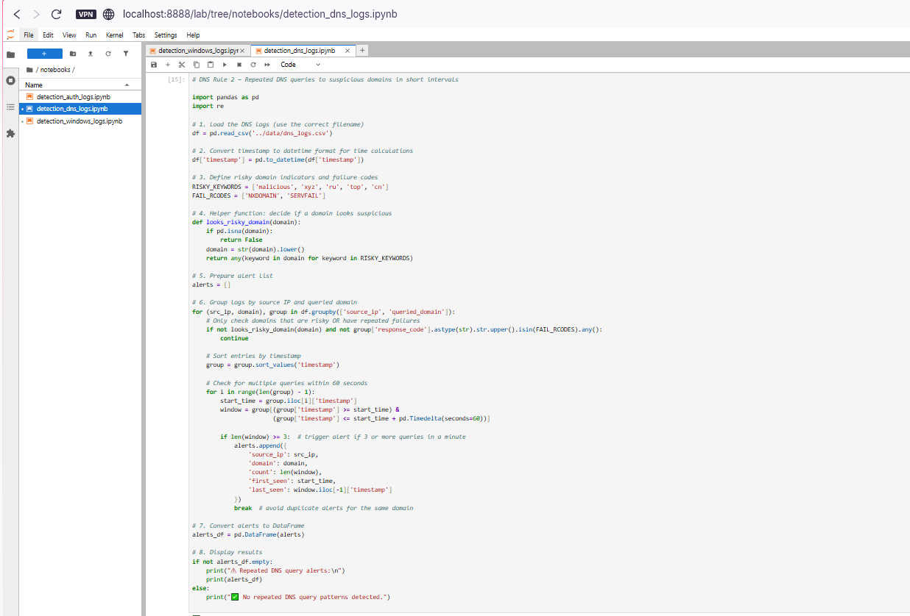

_Logic Part 2_  

_Detection Output (No IOC)_  
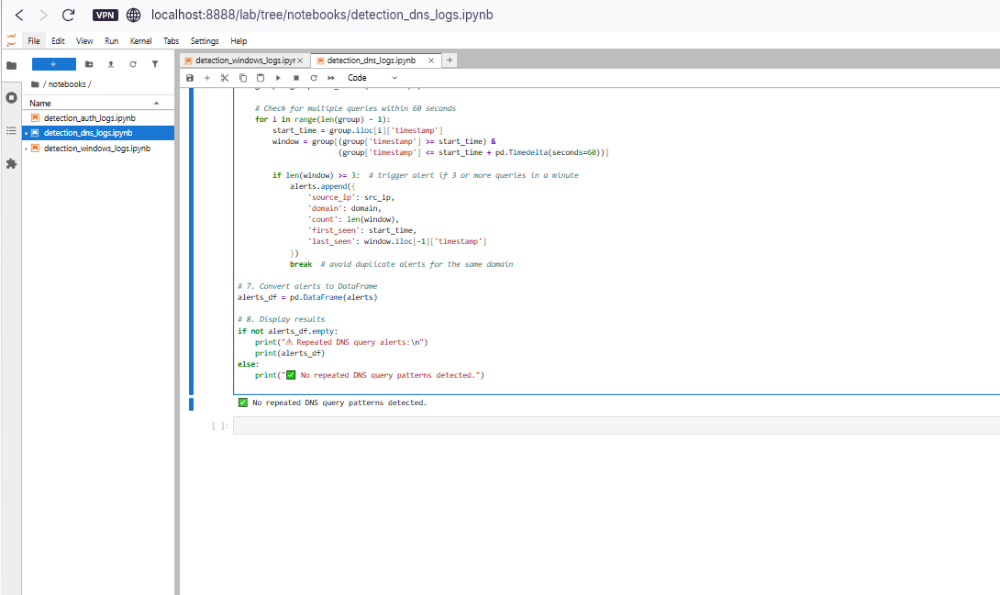

View DNS Rule 2 Screenshots (After IOC Injection)

_IOC Detection Logic_  

_IOC Detection Output_  

_Preview of Injected Rows (stealer.cn)_  
.PNG)

### Rule 3 – DNS Exfiltration via Encoded Subdomains  
This rule detects possible DNS exfiltration attempts by looking for encoded subdomains that resemble base64 patterns — often used in C2 communications or data theft via DNS tunnelling.

See how this rule works, why it matters, and what it looks like in action

**Analyst Note:**  
This rule was designed to catch unusual subdomain patterns that indicate an attacker might be using DNS to sneak data out of a network. I focused on base64-style strings and hex-style indicators (long sequences of a–f or 0–9), which are both classic signs of encoded payloads. Instead of looking just at the main domain, I split subdomains and scanned for suspicious labels. The rule flagged multiple alerts in real log data, which is a solid indication that this technique works in real environments — no artificial IOC was needed.

**Framework Reference:**  
- **MITRE ATT&CK T1048.003** – Data Exfiltration over Unconventional Protocol: DNS  
- **NIST CSF DE.CM-1**, **DE.AE-5**, **SP 800-92** – Detect abnormal subdomain activity  
- **CIS Control 13.9** – Monitor DNS traffic for unusual patterns

**Logic Summary:**
- Split queried domains into labels  
- Use regex to detect base64-style (≥10 chars) or hex-style (≥20 hex digits) encodings  
- Filter for failed DNS response codes to catch attempts that didn’t resolve normally  
- Display alert rows, including the encoded label found

View DNS Rule 3 Screenshots

_Detection Logic_  
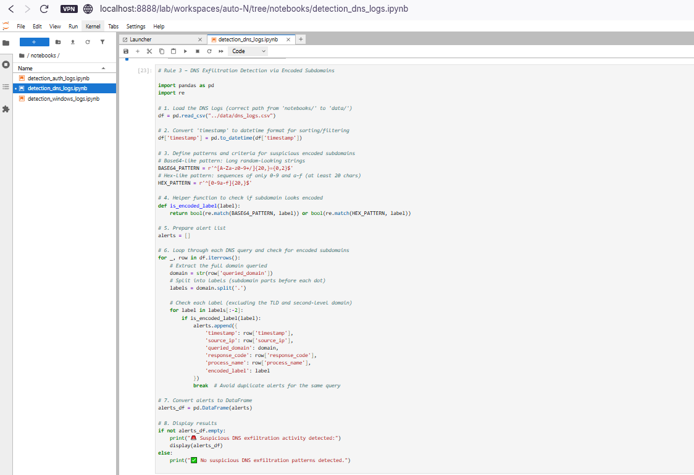

_Detection Output_  
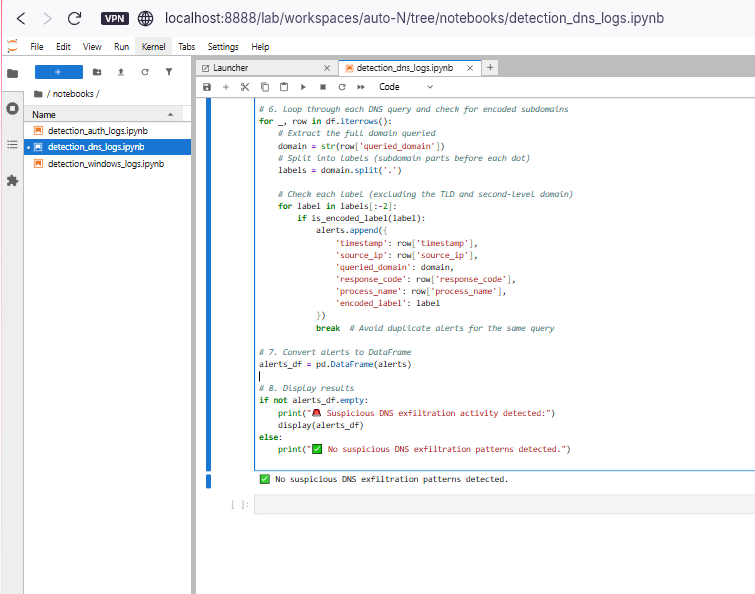

---
---

<strong>Windows Log Detections</strong> — <em>Data Source: windows_logs.csv</em>

| Rule # | Detection Description |
|--------|------------------------|
| 1 | Suspicious parent-child process execution |
| 2 | Repeated failed logins (Event ID 4625) |
| 3 | Privilege escalation attempts (Event ID 4672) |

---

### Rule 1 – Suspicious Parent-Child Process Execution  
Some phishing payloads abuse trusted parent apps like Word or Explorer to silently spawn dangerous tools like PowerShell. This rule detects that abuse chain before the attacker can escalate.

See how this rule works, why it matters, and what it looks like in action

**Analyst Note:**  
This detection was based on real attack patterns I’ve studied, where phishing attachments trigger PowerShell from Word or Outlook. My log source didn’t include the `parent_process` field, so I simulated it using synthetic test data during the dataset creation phase. I then wrote logic to catch trusted parent apps launching suspicious child processes like `powershell.exe`, `cmd.exe`, or `certutil.exe`. This helped me understand how process lineage can expose attacker behaviour that would otherwise slip past basic IOC matching.

**Operational Use Case:**  
Ideal for detecting living-off-the-land techniques where attackers leverage trusted applications to launch malicious code. Can be applied to endpoint detection telemetry in real SOC environments.

**Framework Reference:**  
- **MITRE ATT&CK T1059** – Command and Scripting Interpreter  
- **NIST CSF DE.AE-2**, **NIST 800-61 Step 2.2** – Detect abnormal process chains  
- **CIS Control 8.7** – Alert on unexpected command-line execution

**Logic Summary:**
- Simulate a `parent_process` column  
- Convert process names to lowercase for consistent matching  
- Filter for cases where trusted apps (e.g. `explorer.exe`, `winword.exe`) launch high-risk processes (`powershell.exe`, `certutil.exe`, etc.)

View Windows Rule 1 Screenshots

_Preview of Raw Windows Logs_  
  

_Detection Logic_  
  

_Detection Output (Detection Triggered)_  
  

---

### Rule 2 – Repeated Failed Logins from Same Host  
Attackers often attempt password guessing by repeatedly submitting incorrect credentials from a single endpoint. This rule flags five or more failed logins from the same host within a short time window.

See how this rule works, why it matters, and what it looks like in action

**Analyst Note:**  
I built this rule to simulate brute-force login detection using Event ID 4625. I tested several thresholds and decided that five failures in two minutes was aggressive enough to catch real threats without overwhelming the SOC with noise. It taught me how to group events by host and time to simulate basic correlation — a key skill in detection engineering and alert tuning.

**Operational Use Case:**  
Helps SOC analysts detect brute-force attempts against Windows systems, especially in RDP or SMB login scenarios.

**Test Data Notes:**  
Test data shows the rule correctly did not fire on clean logs. A synthetic IOC was injected to demonstrate detection.

**Framework Reference:**  
- **MITRE ATT&CK T1110.001** – Password Guessing  
- **NIST CSF DE.AE-1**, **CIS Control 16.11** – Detect excessive failed logins from the same source

**Logic Summary:**
- Filter Windows logs for `event_id` 4625 (failed logon)  
- Group events by `host` and sort chronologically  
- Trigger alert if five or more failures occur within two minutes

View Windows Rule 2 Screenshots

_Detection Logic (Clean Run)_  
  

_Clean Dataset Output_  
  

_Synthetic IOC Output (Alert Triggered)_  
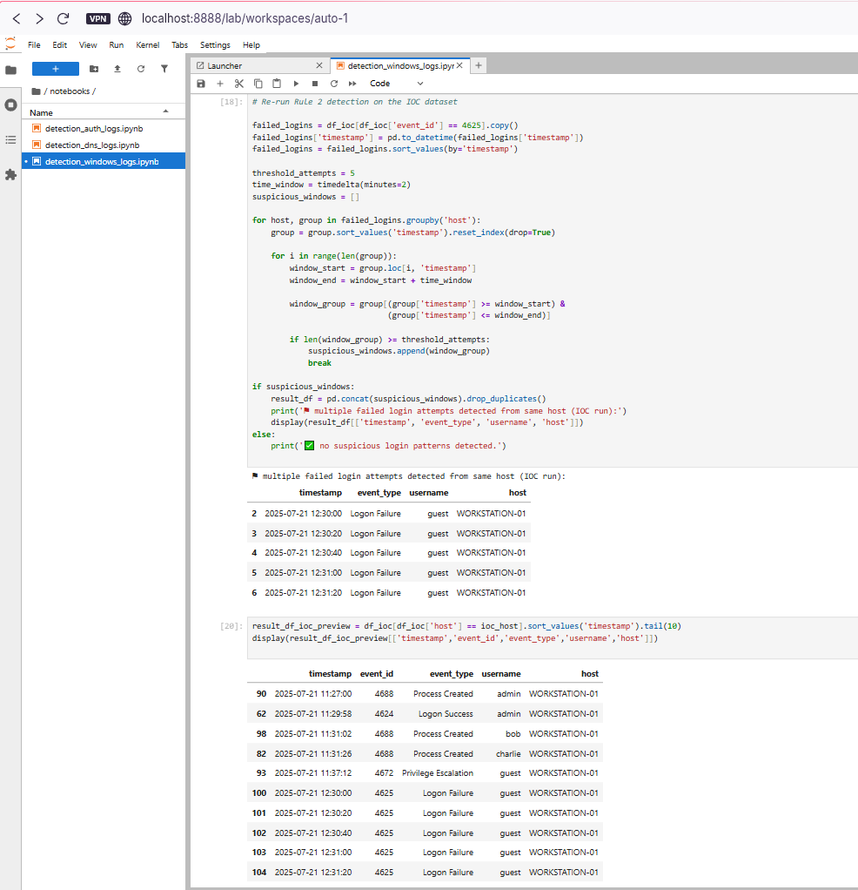  

---

### Rule 3 – Privilege Escalation Detection (Event ID 4672)  
Abusing admin privileges after gaining access is a common tactic in lateral movement. This detection surfaces those actions when they originate from suspicious users or endpoints.

See how this rule works, why it matters, and what it looks like in action

**Analyst Note:**  
I designed this rule to detect high-privilege activity where it doesn't belong. Event ID 4672 logs special privilege assignments, so I used that as the foundation and filtered for low-trust usernames like `guest` or `svc_account`, along with hosts that typically shouldn't request elevated access. It helped me simulate real-world post-exploitation behaviour — and reinforced how valuable user and device context can be in detection logic.

**Operational Use Case:**  
Effective for catching privilege misuse after initial compromise. Particularly useful for detecting lateral movement or insider threats.

**Framework Reference:**  
- **MITRE ATT&CK T1078.003** – Valid Accounts: Local Accounts  
- **NIST 800-61 Step 2.3**, **CIS Control 4.8** – Monitor for unusual privileged account activity

**Logic Summary:**
- Filter for Event ID 4672 (special privileges assigned)  
- Flag events triggered by suspicious accounts or non-admin endpoints  
- Output metadata such as timestamp, username, host, and privileges granted

View Windows Rule 3 Screenshots

_Detection Logic_  
  

_Detection Output (Detection Triggered)_  
  

---
---

<strong>Authentication Log Detections</strong> — <em>Data Source: auth_logs.csv</em>

| Rule # | Detection Description |
|--------|------------------------|
| 1 | 5+ failed logins from same IP within 60 seconds |
| 2 | 5+ unique usernames attempted from same IP within 60 seconds |
| 3 | Successful login after multiple failures from same IP in 10 minutes |

---

### Rule 1 – Brute-Force Login Attempts (Vertical Attack)  
Multiple failed login attempts from the same IP in a short window often indicate brute-force activity. This detection highlights that behaviour before an attacker gains access.

See how this rule works, why it matters, and what it looks like in action

**Analyst Note:**  
This was the first authentication detection I developed. I simulated vertical brute-force behaviour (one IP repeatedly failing to log in) and tuned it to trigger only when five or more failures happened within 60 seconds. I tested different time windows before settling on this threshold, which felt aggressive enough for early detection without overwhelming the analyst.  
This rule taught me how to group login attempts and control alert sensitivity using timestamp logic.

**Operational Use Case:**  
Designed for early detection of brute-force login attempts before credentials are compromised. Particularly useful for monitoring public-facing services, VPN gateways, and admin portals.

**Test Data Notes:**  
- Clean logs: **No alert triggered**.  
- IOC injected: **Alert fired**, confirming correct detection.

**Framework Reference:**  
- **MITRE ATT&CK T1110.001** – Password Guessing  
- **NIST CSF DE.AE-3**, **CIS Control 16.11** – Detect excessive failed authentication attempts

**Logic Summary:**
- Filter logs with status `'FAIL'`
- Group by source IP  
- Sort by time and alert if five or more failures occur within 60 seconds

View Authentication Rule 1 Screenshots

_Logic (Original Detection)_  
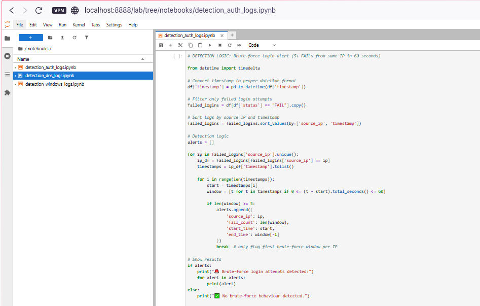  

_Output (Clean Logs – No Detection)_  
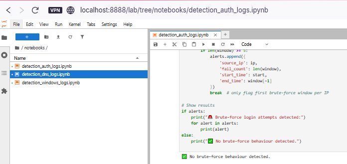  

_Output (Synthetic IOC Injected – Detection Triggered)_  
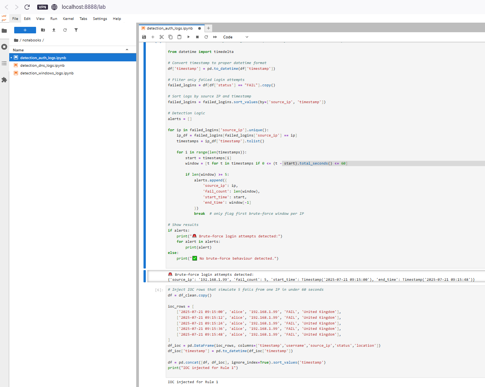  

---

### Rule 2 – Password Spraying Detection (Horizontal Attack)  
When attackers try many usernames with one password from a single IP, they often avoid account lockouts. This rule detects that pattern early by tracking unique usernames per source.

See how this rule works, why it matters, and what it looks like in action

**Analyst Note:**  
Unlike vertical brute-force attacks, password spraying takes a broader approach. I shifted my perspective from **volume** to **variety**—how many **different** usernames an IP tries in a short burst.  
I used a 60-second sliding window per IP and flagged attempts where ≥5 distinct usernames were targeted.  
I validated both failure and success paths with synthetic test data.

**Operational Use Case:**  
Effective for detecting slow-and-low password spraying attacks that bypass account lockout policies. Works well for large enterprise Active Directory environments, SaaS logins, and VPN authentication endpoints.

**Framework Reference:**  
- **MITRE ATT&CK T1110.003** – Password Spraying  
- **CIS Control 16.12** – Detect excessive username attempts from a single source

**Logic Summary:**
- Group login attempts by `source_ip`  
- For each attempt, look ahead 60 seconds (sliding window)  
- Count **unique** usernames in that window  
- Alert if the count ≥ 5

**Test Outcome:**
- Clean dataset: **No alert** (rule did not fire on normal traffic)  
- IOC injected: **Alert triggered** for 5 usernames in 60 seconds

View Authentication Rule 2 Screenshots

_Logic (with clean run)_  
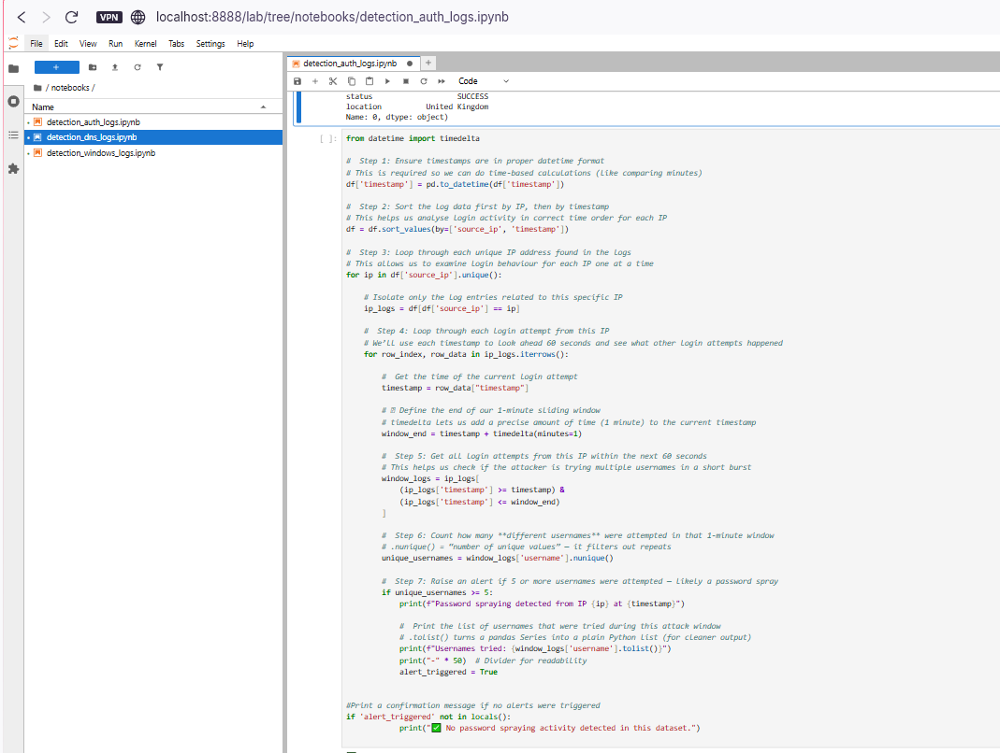  

_Clean dataset output_  
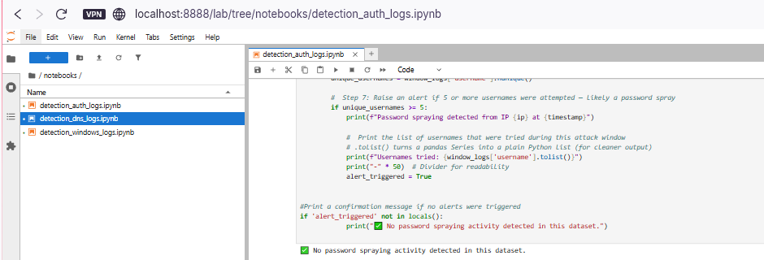  

_Synthetic IOC output (alert)_  
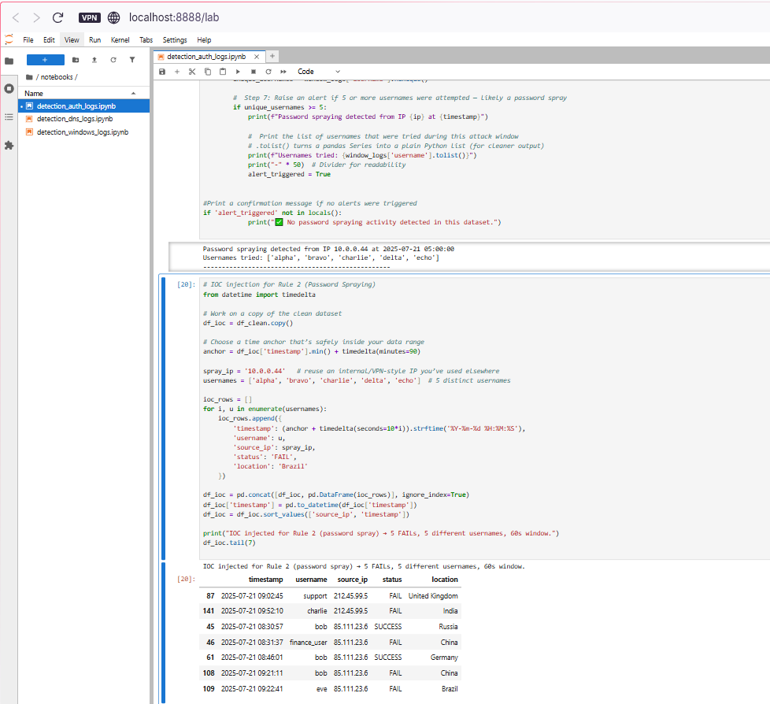  

---

### Rule 3 – Success After Multiple Failures (Suspicious Login Pattern)  
A successful login immediately following multiple failures can indicate a brute-force or password guessing attack that has just succeeded.

See how this rule works, why it matters, and what it looks like in action

**Analyst Note:**  
This rule looks for a “fail → fail → fail → success” sequence within 10 minutes from the same IP.  
It’s designed to detect situations where attackers eventually guess the correct password, gain access, and potentially escalate privileges.  
I simulated this by creating multiple failed attempts followed by a successful login in the test dataset.

**Operational Use Case:**  
Critical for post-authentication monitoring. Detecting this pattern helps analysts quickly respond to compromised accounts, even if the initial attack was missed.

**Framework Reference:**  
- **MITRE ATT&CK T1078** – Valid Accounts  
- **NIST CSF DE.AE-5** – Detect successful login anomalies after failures  
- **CIS Control 16.14** – Detect successful logins following failed attempts

**Logic Summary:**
- Identify IPs with at least one successful login  
- Look backwards to find failed logins from the same IP within 10 minutes  
- Trigger alert if ≥3 failures occurred before the success

**Test Outcome:**
- Clean dataset: **No alert triggered**  
- IOC injected: **Alert fired** showing attacker IP, username, fail count, and timestamps

View Authentication Rule 3 Screenshots

_Logic (Original Detection)_  
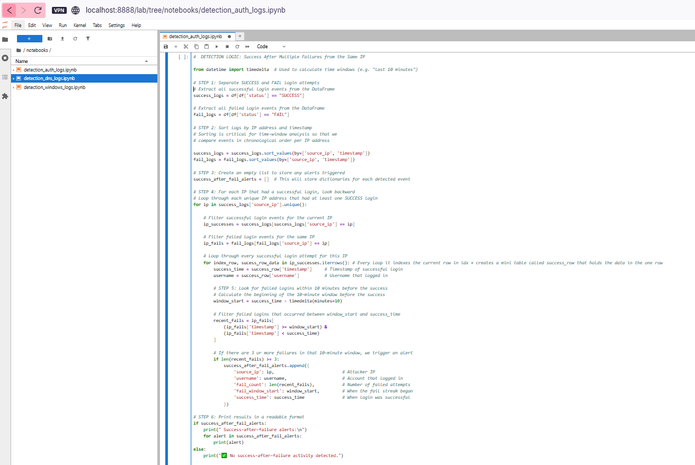  

_Output (Clean Logs – No Detection)_  
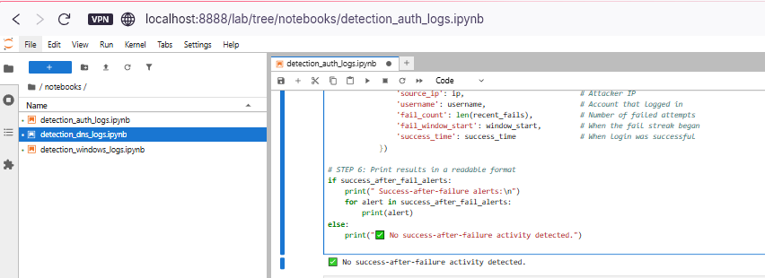  

_Output (Synthetic IOC Injected – Detection Triggered)_  
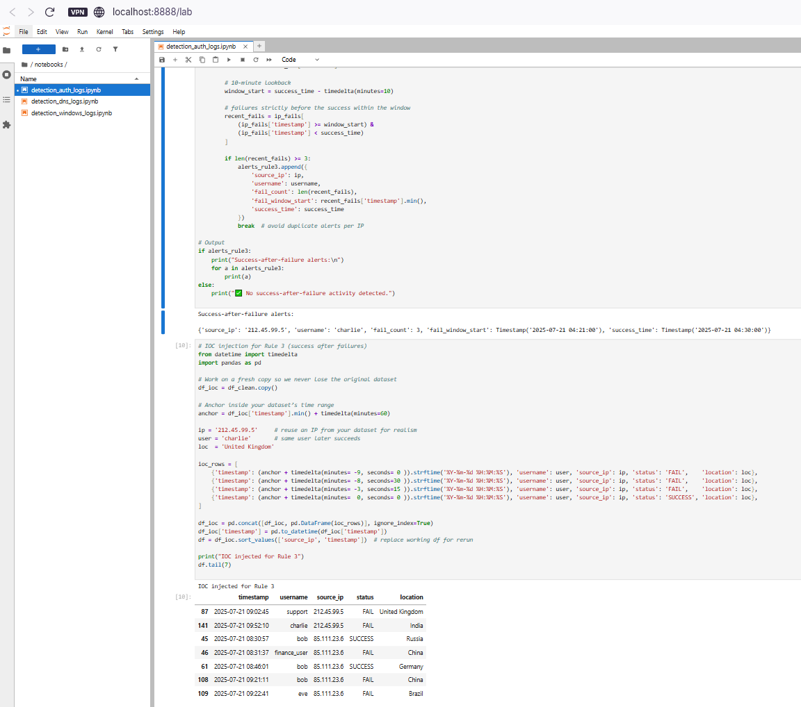  

---
---

## 6. Splunk SIEM (Phase 2)

This next stage will mirror all detection logic in Splunk,  allowing for:
- SIEM-style alerting and dashboard creation
- Field extraction and log tagging
- Hands-on experience with SPL (Search Processing Language)

**Upcoming Steps:**
- [ ] Upload all `.csv` log files to Splunk Cloud
- [ ] Rebuild Python logic in SPL
- [ ] Create dashboards to simulate alert triage
- [ ] Include Splunk output screenshots in `README.md`

---

## 7. Skills Demonstrated

- Detection engineering across multiple log types
- Time-based filtering and alert logic using Python
- Regular expression design for DNS anomaly detection
- Log enrichment and behavioural analysis
- Cross-platform thinking (Jupyter to Splunk)
- Documentation of technical reasoning and alerts

---

## 8. Screenshots Directory

All screenshots mentioned above are located in the `/screenshots/` folder. Each filename corresponds to the relevant rule output.

---

## 9. Let’s Connect

**Hussien Kofi**  
Aspiring SOC Analyst | Threat-Informed | Detection-Focused

- [Email](mailto:Hussienkofi@gmail.com)  
- [LinkedIn](https://www.linkedin.com/in/hussien-kofi-99a012330/)  
- [GitHub](https://github.com/Hussien-K11)

This project is part of a hands-on cybersecurity portfolio focused on building a foundational understanding of log-based threat detection, SIEM integration, and practical alert development. Every detection rule was written with the mindset of a junior analyst preparing to work in a real SOC.
