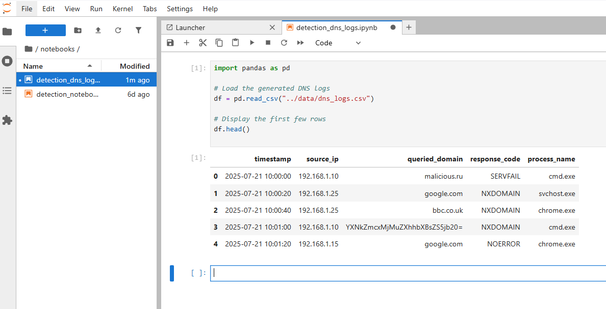
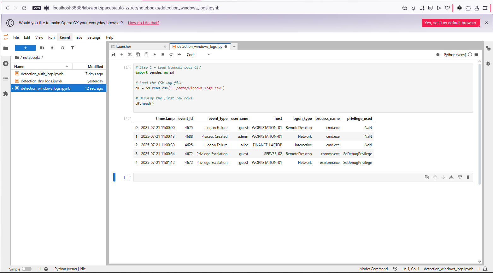
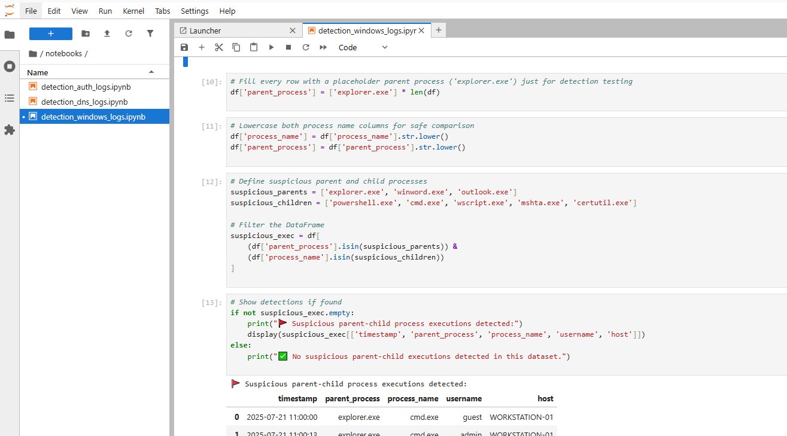
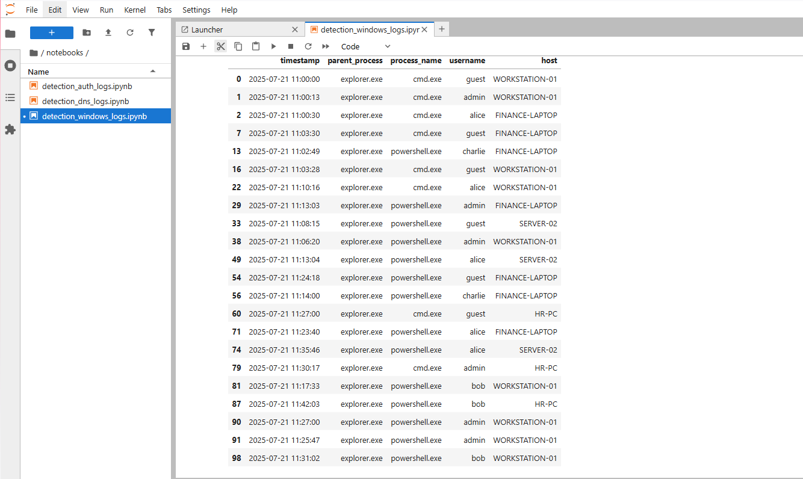
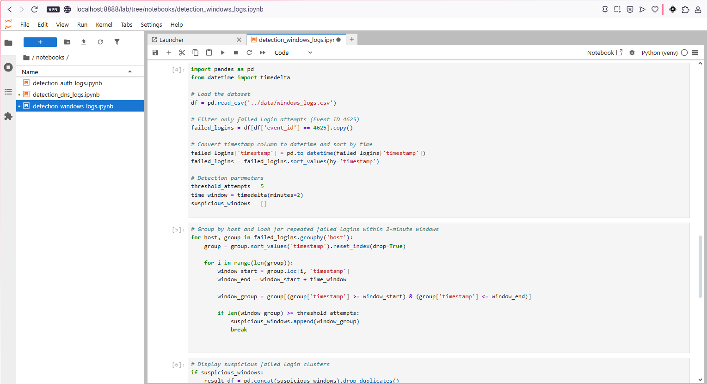
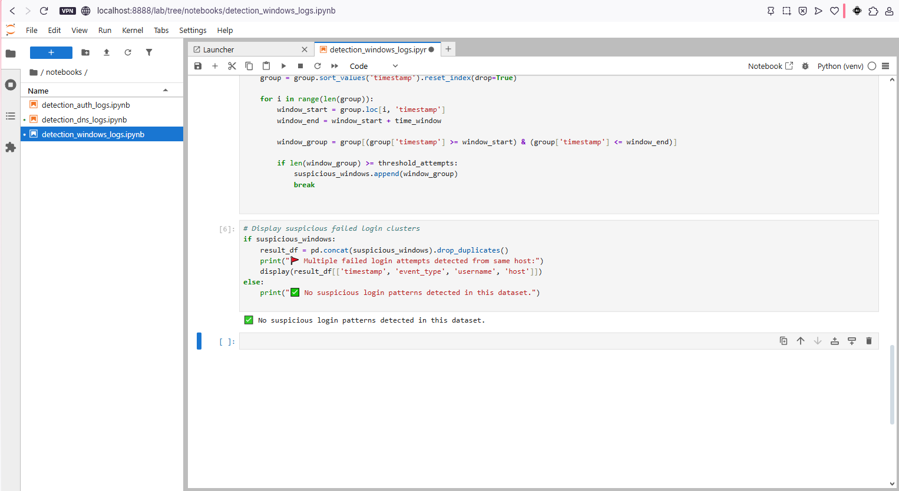
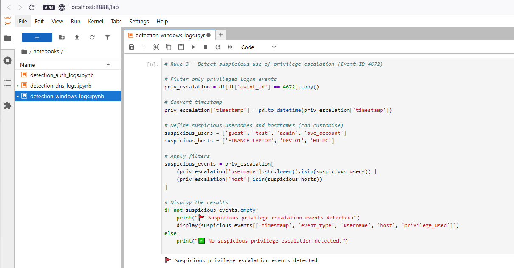
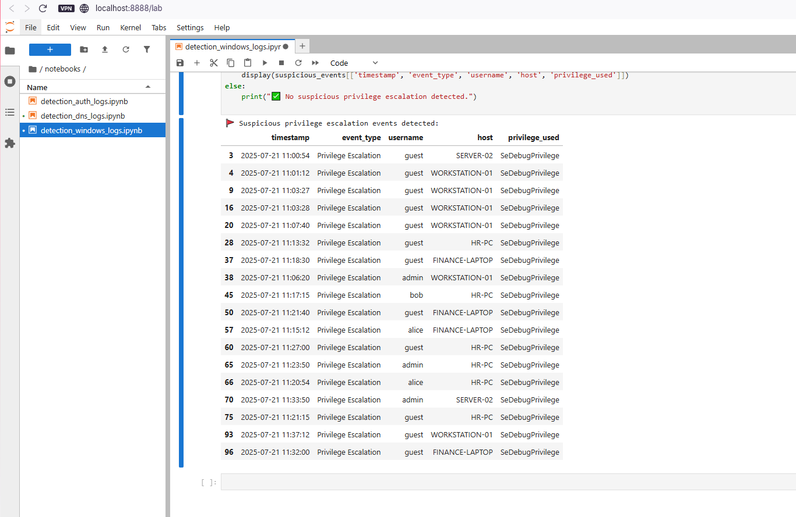

# Simple-SIEM-Simulation

## 1. Project Overview

This project simulates real-world SOC detection workflows using structured logs and multi-platform detection logic across Python and Splunk. Inspired by enterprise practices, the goal is to demonstrate a threat-informed, framework-aligned approach to security monitoring — using detection logic that maps to the MITRE ATT&CK framework, and operational practices drawn from NIST CSF, NIST 800-61, and CIS Controls.

The project reflects Tier 1 SOC responsibilities such as:
- Reviewing DNS, Authentication, and Windows logs
- Writing detection logic in Python
- Correlating events and identifying suspicious behaviour
- Documenting detections and preparing escalation summaries

---

## 2. Project Structure

| Phase      | Description                                          | Tools             |
|------------|------------------------------------------------------|-------------------|
| Phase 1    | Python-based detection logic and simulation          | Jupyter, pandas   |
| Phase 2    | Detection logic replicated and tested in Splunk Cloud| Splunk Cloud, SPL |

---
## 3. Jupyter-Based Detection Logic

This section showcases detection rules written in Python using Jupyter notebooks. Each rule is designed to reflect real-world SOC workflows: reviewing logs, applying logic, filtering out noise, and flagging suspicious behaviour. Every rule is aligned with adversary techniques from the MITRE ATT&CK framework, mapped to NIST CSF functions, and rooted in practical detection goals from CIS Controls.

---

<strong>DNS Log Detections</strong> — <em>Data Source: dns_logs.csv</em>

| Rule # | Detection Description |
|--------|------------------------|
| 1 | Suspicious DNS queries to known-bad or randomised domains |
| 2 | [Planned] Repeated DNS queries to suspicious domains within short intervals |
| 3 | [Planned] DNS exfiltration pattern detection via encoded subdomains |

---

### Rule 1 – Suspicious DNS Query Detection  
This rule flags DNS traffic that resembles beaconing or C2 activity. It targets base64-style strings, shady top-level domains, and failed lookups that don’t belong in typical user traffic.

See how this rule works, why it matters, and what it looks like in action

**Analyst Note:**  
I built this rule to detect domains that just don’t belong in regular business traffic. I was especially looking for signs of malware beaconing, like encoded strings in the subdomain or uncommon top-level domains such as `.ru` or `.xyz`. I added an extra filter to catch failed lookups (`NXDOMAIN`, `SERVFAIL`) to cut out noise from valid requests. This gave me hands-on practice designing logic that can reduce false positives while still catching high-risk patterns.

**Framework Reference:**  
- **MITRE ATT&CK T1071.004** – Application Layer Protocol: DNS  
- **NIST CSF DE.AE-3**, **NIST SP 800-92** – Detect anomalies via failed resolution patterns  
- **CIS Control 13.8** – Monitor and alert on anomalous DNS activity

**Logic Summary:**
- Use regex to detect base64-style or randomised subdomains  
- Flag risky TLDs like `.ru`, `.xyz`, `.top`  
- Filter for failed DNS response codes such as `NXDOMAIN` and `SERVFAIL`

View DNS Rule 1 Screenshots

_Preview of Raw DNS Logs_  

_Suspicious Queries (Part 1)_  
.png)

_Suspicious Queries (Part 2)_  
.png)

---
---

<strong>Windows Log Detections</strong> — <em>Data Source: windows_logs.csv</em>

| Rule # | Detection Description |
|--------|------------------------|
| 1 | Suspicious parent-child process execution |
| 2 | Repeated failed logins (Event ID 4625) |
| 3 | Privilege escalation attempts (Event ID 4672) |

---

### Rule 1 – Suspicious Parent-Child Process Execution  
Some phishing payloads abuse trusted parent apps like Word or Explorer to silently spawn dangerous tools like PowerShell. This rule detects that abuse chain before the attacker can escalate.

See how this rule works, why it matters, and what it looks like in action

**Analyst Note:**  
This detection was based on real attack patterns I’ve studied, where phishing attachments trigger PowerShell from Word or Outlook. My log source didn’t include the `parent_process` field, so I simulated it using synthetic test data. I then wrote logic to catch trusted parent apps launching suspicious child processes like `powershell.exe`, `cmd.exe`, or `certutil.exe`. This helped me understand how process lineage can expose attacker behaviour that would otherwise slip past basic IOC matching.

**Framework Reference:**  
- **MITRE ATT&CK T1059** – Command and Scripting Interpreter  
- **NIST CSF DE.AE-2**, **NIST 800-61 Step 2.2** – Detect abnormal process chains  
- **CIS Control 8.7** – Alert on unexpected command-line execution

**Logic Summary:**
- Simulate a `parent_process` column  
- Convert process names to lowercase for consistent matching  
- Filter for cases where trusted apps (e.g. `explorer.exe`, `winword.exe`) launch high-risk processes (`powershell.exe`, `certutil.exe`, etc.)

View Windows Rule 1 Screenshots

_Preview of Raw Windows Logs_  

_Detection Logic_  

_Detection Output_  

---

### Rule 2 – Repeated Failed Logins from Same Host  
Attackers often attempt password guessing by repeatedly submitting incorrect credentials from a single endpoint. This rule flags five or more failed logins from the same host within a short time window.

See how this rule works, why it matters, and what it looks like in action

**Analyst Note:**  
I built this rule to simulate brute-force login detection using Event ID 4625. I tested several thresholds and decided that five failures in two minutes was aggressive enough to catch real threats without overwhelming the SOC with noise. It taught me how to group events by host and time to simulate basic correlation — a key skill in detection engineering and alert tuning.

**Framework Reference:**  
- **MITRE ATT&CK T1110.001** – Password Guessing  
- **NIST CSF DE.AE-1**, **CIS Control 16.11** – Detect excessive failed logins from the same source

**Logic Summary:**
- Filter Windows logs for `event_id` 4625 (failed logon)  
- Group events by `host` and sort chronologically  
- Trigger alert if five or more failures occur within two minutes

View Windows Rule 2 Screenshots

_Detection Logic_  

_Detection Output_  

---

### Rule 3 – Privilege Escalation Detection (Event ID 4672)  
Abusing admin privileges after gaining access is a common tactic in lateral movement. This detection surfaces those actions when they originate from suspicious users or endpoints.

See how this rule works, why it matters, and what it looks like in action

**Analyst Note:**  
I designed this rule to detect high-privilege activity where it doesn't belong. Event ID 4672 logs special privilege assignments, so I used that as the foundation and filtered for low-trust usernames like `guest` or `svc_account`, along with hosts that typically shouldn't request elevated access. It helped me simulate real-world post-exploitation behaviour — and reinforced how valuable user and device context can be in detection logic.

**Framework Reference:**  
- **MITRE ATT&CK T1078.003** – Valid Accounts: Local Accounts  
- **NIST 800-61 Step 2.3**, **CIS Control 4.8** – Monitor for unusual privileged account activity

**Logic Summary:**
- Filter for Event ID 4672 (special privileges assigned)  
- Flag events triggered by suspicious accounts or non-admin endpoints  
- Output metadata such as timestamp, username, host, and privileges granted

View Windows Rule 3 Screenshots

_Detection Logic_  

_Detection Output_  

---

---

<strong>Authentication Log Detections</strong> — <em>Data Source: auth_logs.csv</em>

| Rule # | Detection Description |
|--------|------------------------|
| 1 | 5+ failed logins from same IP within 60 seconds |
| 2 | 5+ unique usernames attempted from same IP within 60 seconds |
| 3 | Successful login after multiple failures from same IP in 10 minutes |

---

### Rule 1 – Brute-Force Login Detection  
This rule catches vertical brute-force attacks, where a single IP repeatedly attempts to log in within a short window. It reflects a high-confidence pattern that most SOCs monitor closely.

See how this rule works, why it matters, and what it looks like in action

**Analyst Note:**  
This was the first detection I built for this project. I grouped failed logins by IP address within a one-minute window, simulating how SIEM tools like Splunk or Sentinel handle brute-force detection. I tested multiple thresholds before settling on five attempts in 60 seconds, which felt realistic for spotting early-stage attacks without flooding the SOC with false positives.

**Framework Reference:**  
- **MITRE ATT&CK T1110.001** – Brute Force  
- **NIST CSF DE.AE-3**, **CIS Control 16.11** – Detect excessive failed authentication attempts

**Logic Summary:**
- Filter logins with status ‘FAIL’  
- Group by source IP and sort chronologically  
- Alert if 5 or more attempts occur in under 60 seconds

View Authentication Rule 1 Screenshots

_Add screenshot: `auth_rule1_bruteforce_output.png`_

---

### Rule 2 – Password Spraying Detection  
Unlike brute-force attacks, this rule detects horizontal attempts where many usernames are targeted from a single IP. It reflects stealthier behaviour designed to avoid account lockouts.

See how this rule works, why it matters, and what it looks like in action

**Analyst Note:**  
I designed this rule to detect password spraying, which avoids triggering lockouts by spreading login attempts across multiple usernames. It required a shift in thinking compared to Rule 1. Instead of counting raw login failures, I focused on unique usernames within a 60-second period. This helped me practise recognising slower, stealthier attacks that are easy to miss.

**Framework Reference:**  
- **MITRE ATT&CK T1110.003** – Password Spraying  
- **CIS Control 16.12** – Detect excessive username attempts from a single source

**Logic Summary:**
- Group events by source IP  
- Count distinct usernames per IP within 60 seconds  
- Alert when five or more usernames are targeted

View Authentication Rule 2 Screenshots

_Add screenshot: `auth_rule2_passwordspray_output.png`_

---

### Rule 3 – Success After Failures  
This rule identifies a successful login that follows a burst of failed attempts from the same IP. It’s a strong signal of potential compromise, often missed unless correlation is applied.

See how this rule works, why it matters, and what it looks like in action

**Analyst Note:**  
This was the most insightful rule to build. It models a realistic compromise where an attacker guesses the right credentials after a series of failed attempts. I used a 10-minute time window to link successful logins with recent failures from the same IP. It helped me understand how context-aware detection can uncover threats traditional tools might miss.

**Framework Reference:**  
- **MITRE ATT&CK T1078.004** – Valid Accounts: Cloud Accounts  
- **NIST SP 800-61 Step 2.4**, **CIS Control 16.13** – Monitor successful authentication after repeated failure

**Logic Summary:**
- Detect successful login attempts  
- Correlate with prior failed attempts from the same IP  
- Trigger if three or more failures occurred in the last 10 minutes

View Authentication Rule 3 Screenshots

_Add screenshot: `auth_rule3_success_after_fail.png`_

---

## 6. Splunk SIEM (Phase 2)

This next stage will mirror all detection logic in Splunk,  allowing for:
- SIEM-style alerting and dashboard creation
- Field extraction and log tagging
- Hands-on experience with SPL (Search Processing Language)

**Upcoming Steps:**
- [ ] Upload all `.csv` log files to Splunk Cloud
- [ ] Rebuild Python logic in SPL
- [ ] Create dashboards to simulate alert triage
- [ ] Include Splunk output screenshots in `README.md`

---

## 7. Skills Demonstrated

- Detection engineering across multiple log types
- Time-based filtering and alert logic using Python
- Regular expression design for DNS anomaly detection
- Log enrichment and behavioural analysis
- Cross-platform thinking (Jupyter to Splunk)
- Documentation of technical reasoning and alerts

---

## 8. Screenshots Directory

All screenshots mentioned above are located in the `/screenshots/` folder. Each filename corresponds to the relevant rule output.

---

## 9. Let’s Connect

**Hussien Kofi**  
Aspiring SOC Analyst | Threat-Informed | Detection-Focused

- [Email](mailto:Hussienkofi@gmail.com)  
- [LinkedIn](https://www.linkedin.com/in/hussien-kofi-99a012330/)  
- [GitHub](https://github.com/Hussien-K11)

This project is part of a hands-on cybersecurity portfolio focused on building a foundational understanding of log-based threat detection, SIEM integration, and practical alert development. Every detection rule was written with the mindset of a junior analyst preparing to work in a real SOC.
